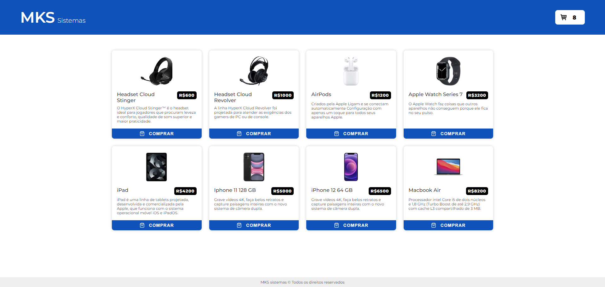

<h1 align="center">Mini Vitrini Virtual</h1>

### Funcionalidades

- [x] Consumir nossa API REST de produtos para exibir a lista de produtos da loja.
- [x] A aplicação deve conter apenas uma página/rota e um carrinho.
- [x] Loja: A lista de produtos deve ser buscada na API
- [ ] Use um shimmer/skeleton enquanto estiver em loading.
- [ ] Carrinho: O carrinho deve conter todos os produtos selecionados, juntamente com a opção de aumentar a quantidade de cada produto selecionado.
- [ ] Use do Jest e a testing-library para realizar os testes unitários.

### Tecnologias Utilizadas

- [x] TypeScript
- [x] React com NextJS
- [x] LocalStorage
- [x] CSS
- [ ] React-query
- [ ] Framer-motion
- [ ] Zustand
- [ ] Jest

## Executar o Projeto

### Pré-requisitos

- Node.js instalado na máquina.
- npm (Node Package Manager) instalado.

## Passos

1 - Baixe O Repositório Em Sua Máquina

2 - Instale As Dendências do Projeto
``` bash
    npm install
```

3 - Execute o projeto:
``` bash
    npm run dev
```

4 - Acesse a Página no Endereço Local: localhost:3000

## Imagem do Projeto


## Lucas Gabriel Moya

- Website - [https://lucasgabrielmoya-nu.vercel.app/](https://lucasgabrielmoya-nu.vercel.app/)
- Linkedin - [Lucas Gabriel Moya](https://www.linkedin.com/in/lucas-gabriel-moya/)